|   |
|---|
||

**TOPTRACER RANGE INCLUDED WITH BUCKET OF BALLS**

**Toptracer Technology:  
​It's Not Just Hitting Balls**

|   |   |
|---|---|
|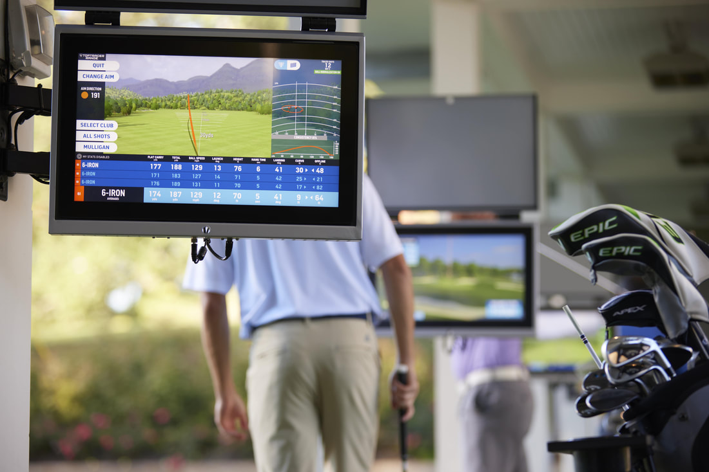|With Toptracer Range technology every golfer—from beginner to a pro—has access to valuable shot insights like carry, distance, club head speed, and ball speed on every shot. Toptracer technology offers tons of data and all kinds of games to engage your imagination, your swing, your friends and even new opponents around the world. From Longest Drive to virtually playing some of the world’s most famous golf courses.       Toptracer is introducing golf to a new generation of players and bringing people together in meaningful ways. We're excited to share that experience with you!|

---

**THE APP**

|   |   |
|---|---|
|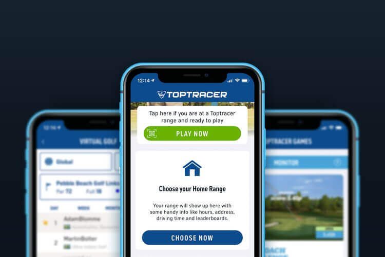|The Toptracer Range app is where the magic happens. When guests create a profile, they instantly become part of a global golf community. The app stores data from practice sessions so players can monitor changes and fine tune their swing over time. For users at Toptracer Range Mobile-enabled facilities, the app is also where they can access skill-based games that will drive their range session.  \|   \|   \|   \|   \| \|---\|---\|---\|---\| \|\|\||

---

**INTERACTIVE PRACTICE**

|   |   |
|---|---|
|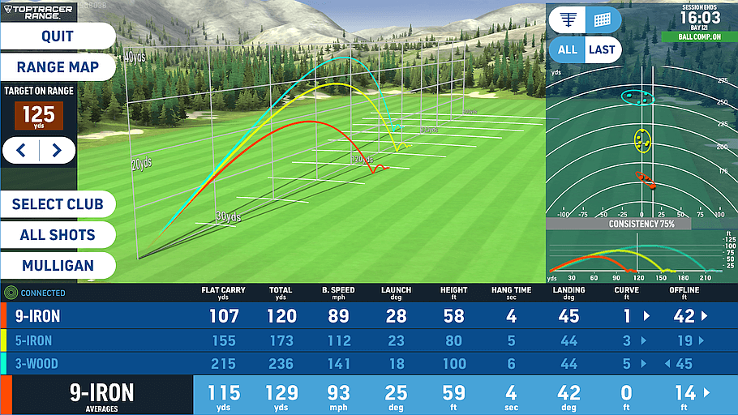|For golfers, Toptracer Range is the ultimate practice tool, taking the guesswork out of range sessions by offering an engaging, data-driven experience that appeals to everyone.      For groups of friends, Toptracer allows everyone to have fun, whether seasoned professional or complete beginner. The variety of games can be used by everyone!|

---

**GAME MODES**

|   |   |
|---|---|
|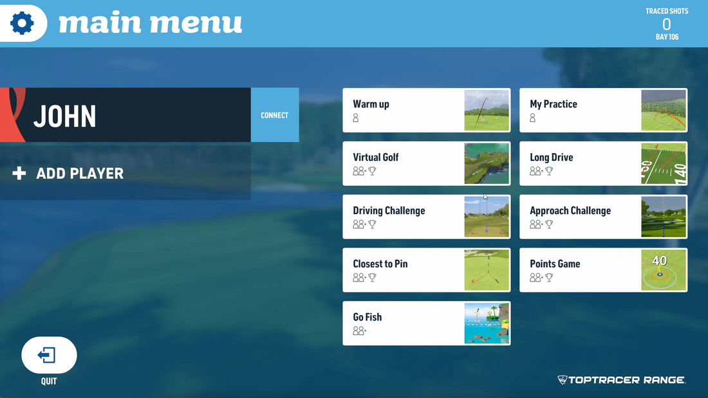|​Toptracer has several game modes ranging from Long Drive, Closest to the Pin, Go Fish (for kids) as well as Practice Mode, Warm-Up Mode, and much more.      Have you ever thought about playing some of the best courses in the world? With Toptracer's Virtual Golf courses  you'll be able to play courses such as St Andrews and Pebble Beach.|

---

**LEADERBOARDS**

|   |   |
|---|---|
|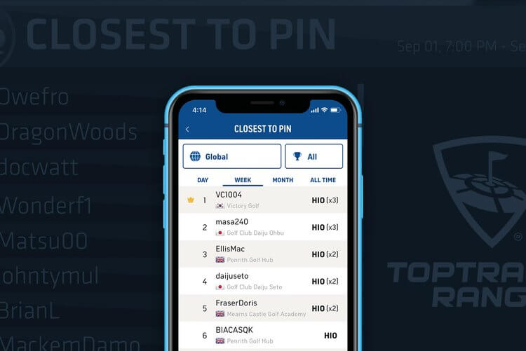|Leaderboards not only fuel friendly competition among players, but they can be a way of helping you achieve your goals and push progression. Accessible within the Toptracer Range app and will also be displayed on TV monitors throughout the range, leaderboards let you see how you stack up against other golfers. They’re updated in real-time to show top performers throughout the week.      **​View Our Weekly Closest To Leaderboard (COMING SOON)**|

**AND MUCH MORE**

**TOPTRACER RANGE INCLUDED WITH BUCKET OF BALLS**

|                                                                                                                                                                          |                                                                                                                                         |                                                                                                                                                         |
| ------------------------------------------------------------------------------------------------------------------------------------------------------------------------ | --------------------------------------------------------------------------------------------------------------------------------------- | ------------------------------------------------------------------------------------------------------------------------------------------------------- |
| ---  **CLOSEST TO THE PIN**  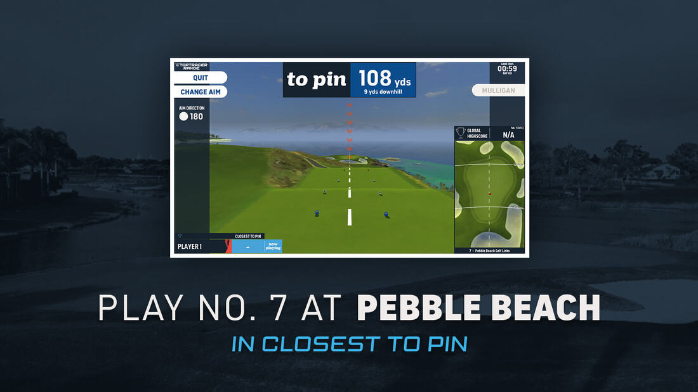 | ---  **LONGEST DRIVE**  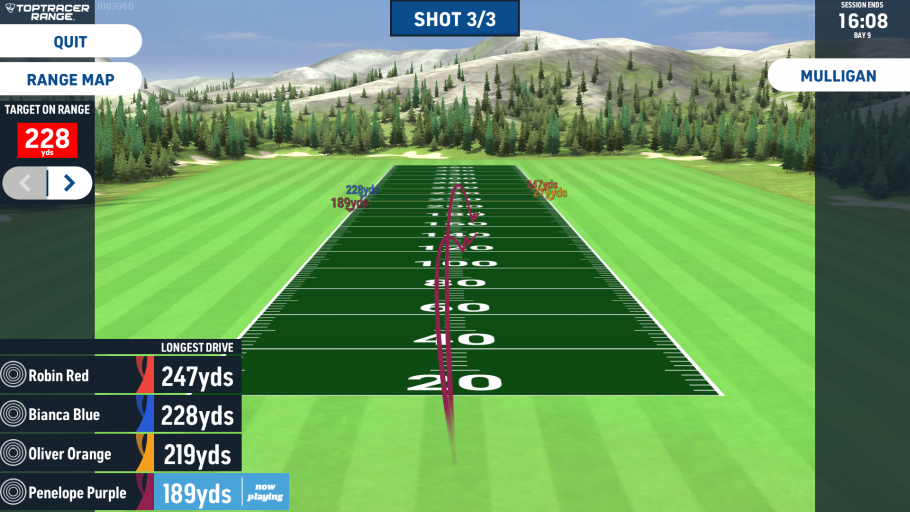 | ---  **GO FISH (KID FRIENDLY)**  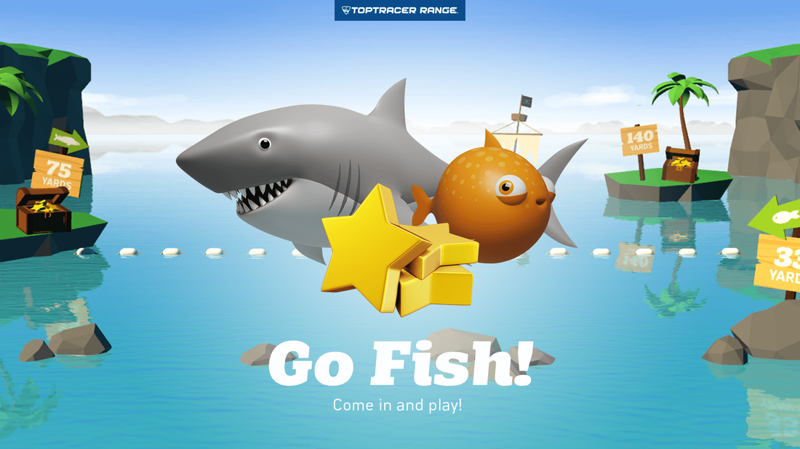 |

|   |   |   |
|---|---|---|
|---  **VIRTUAL GOLF**  |---  **SCRAMBLE GOLF**  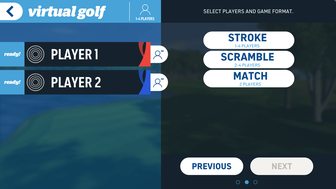|---  **POINTS GAMES**  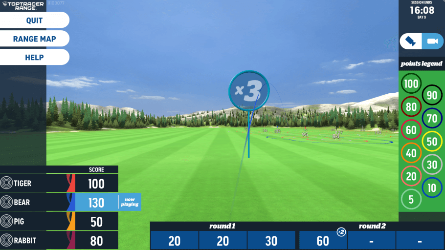|

|                                                                                                                                        |                                                                                                                                                      |                                                                                                                               |
| -------------------------------------------------------------------------------------------------------------------------------------- | ---------------------------------------------------------------------------------------------------------------------------------------------------- | ----------------------------------------------------------------------------------------------------------------------------- |
| ---  **MY PRACTICE**   | ---  **APPROACH CHALLENGE**  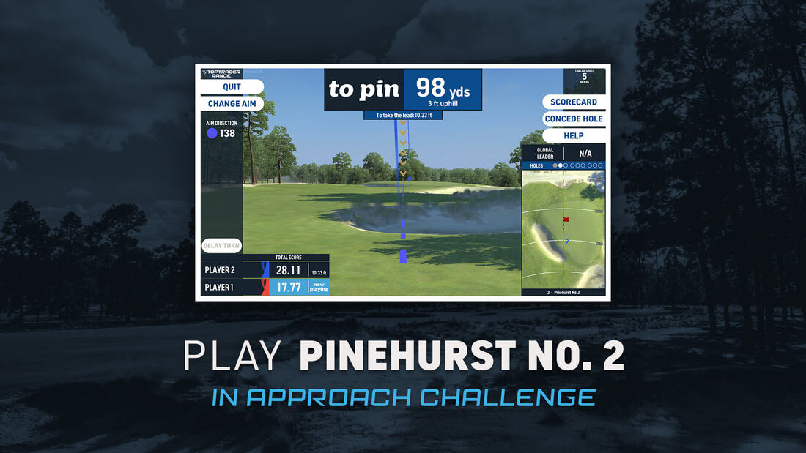 | ---  **WARMUP**  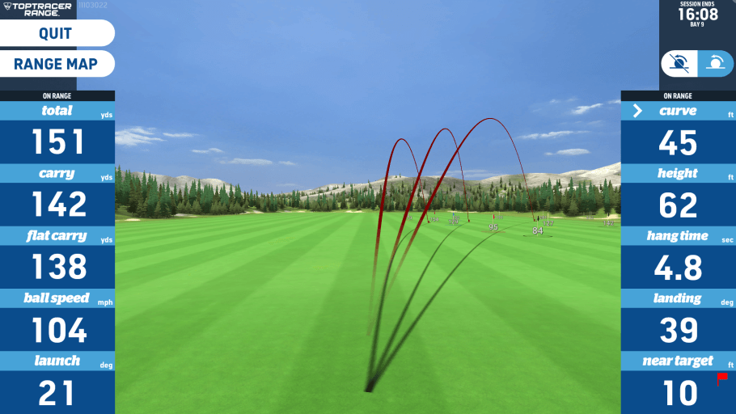 |

---

**TOPTRACER RANGE INCLUDED WITH BUCKET OF BALLS**